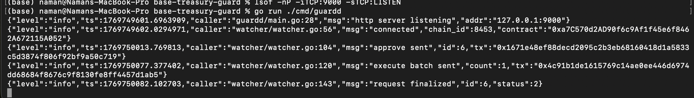
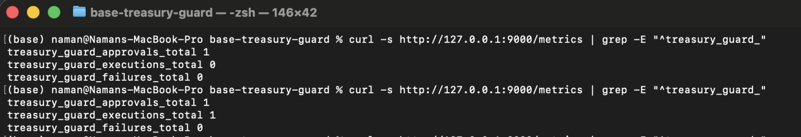
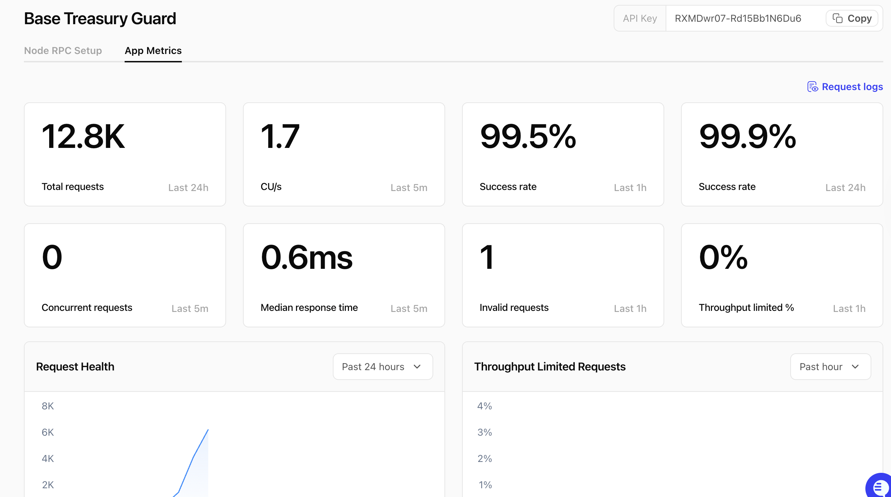

# Base Treasury Guard
Role based spending limits with off chain policy enforcement on Base L2.

## Overview
Base Treasury Guard is a small on‑chain treasury controller plus a Go daemon. The smart contract (`TreasuryGuard`) holds ETH and ERC20, and only executes payouts after a treasurer creates a request, guardians approve it, and a time delay passes. The daemon (`guardd`) watches events, enforces off‑chain policy (amount limits, token allowlist), approves requests, and batches executions to reduce gas.

## Architecture
**On chain** handles custody, approvals, and execution guarantees. **Off chain** handles policy decisions and operational automation.

<p align="center">
  
</p>
<p align="center"><em>Fig 1: Base Treasury Guard Architecture</em></p>

## Quick start
### Prerequisites
- Foundry (forge)
- Go 1.22+
- RPC endpoint (local Anvil or Base Sepolia)
- Env vars (see `.env.example` comment in `internal/config/config.go`)

### Run tests
```
forge test -vv
```

### Deploy to local Anvil
Start Anvil:
```
anvil
```
Export env vars (example):
```
export PRIVATE_KEY=0x...
export TREASURER_ADDR=0x...
export GUARDIAN_ADDR=0x...
export EXECUTOR_ADDR=0x...
```
Deploy:
```
forge script script/DeployTreasuryGuard.s.sol:DeployTreasuryGuard \
  --rpc-url http://127.0.0.1:8545 --broadcast
```

### Run guardd against local chain
Set required env vars (example):
```
export RPC_URL=http://127.0.0.1:8545
export WS_URL=ws://127.0.0.1:8545
export CHAIN_ID=31337
export CONTRACT_ADDRESS=0x...
export GUARDIAN_KEY=0x...
export EXECUTOR_KEY=0x...
```
Run:
```
go run ./cmd/guardd
```
Metrics are served at `HTTP_LISTEN_ADDR` (default `127.0.0.1:9000`) on `/metrics`.

## How it works
- **Request creation**: A treasurer submits a payout request (token, recipient, amount, approvals needed). The contract stores it and emits `RequestCreated`.
- **Approvals**: Guardians approve once each. The daemon can auto‑approve if policy checks pass.
- **Delay and execution**: Requests can only execute after `minDelay` has passed and approvals meet threshold.
- **Batch execution and gas floor**: The daemon groups ready requests and calls `executeBatch`, stopping early if gas remaining drops below `gasFloor`.

## Demo Proof (Request ID 6)
### 1) Create request (Foundry)
```
forge script script/CreateRequest.s.sol:CreateRequest --rpc-url "$RPC_URL" --broadcast
```
- requestId: 6
- eventRequestId: 6
- earliestExec: 1769750065
- tx: 0xd6ec8338839aff6db603f649102738bbd038b85000cbea32377daea80eedbbbb
- paid: 0.000001094306186569 ETH (178163 gas)

### 2) guardd execution (approve + execute + finalize)
```
go run ./cmd/guardd
```
- approve sent id=6 tx=0x1671e48ef88decd2095c2b3eb68160418d1a5833c5d3874f806f92bf9a50c719
- execute batch sent count=1 tx=0x4c91b1de1615769c14ae0ee446d6974dd68684f8676c9f8130fe8ff4457d1ab5
- request finalized id=6 status=2

### 3) Local app metrics after the run
```
curl -s http://127.0.0.1:9000/metrics | grep -E "^treasury_guard_"
```
Metrics are summarized in the Metrics section below.

## Metrics
Prometheus reflects local guardd counters for this run.
### Prometheus (guardd)
| metric | value |
| --- | --- |
| treasury_guard_approvals_total | 1 |
| treasury_guard_executions_total | 1 |
| treasury_guard_failures_total | 0 |

Alchemy RPC dashboard reflects provider-level request health.
### Alchemy RPC dashboard (snapshot)
| metric | value |
| --- | --- |
| Total requests (last 24h) | 12.8K |
| CUs/s (last 5m) | 1.7 |
| Success rate (last 1h) | 99.5% |
| Success rate (last 24h) | 99.9% |
| Concurrent requests (last 5m) | 0 |
| Median response time (last 5m) | 0.6ms |
| Invalid requests (last 1h) | 1 |
| Throughput limited % (last 1h) | 0% |

## Base mainnet deployment
- Contract address: 0xa7C570d2AD90f6c9Af1f45e6f8462A672115A052
- BaseScan contract: https://basescan.org/address/0xa7C570d2AD90f6c9Af1f45e6f8462A672115A052
- BaseScan transaction: https://basescan.org/tx/0xc256792f3830d364cabe7ecb86674e170fc1e9c701a30f97953e345a195fa25a

## Tests
### Solidity (Foundry)
```
forge test -vvv
```
9 tests passed, 0 failed, 0 skipped.
- testAdminIsDeployer
- testCancelBlocksExecute
- testCreateApproveExecuteETH
- testDoubleExecuteReverts
- testExecuteRevertsBeforeDelay
- testExecuteRevertsWithoutApprovals
- testOnlyExecutorCanExecute
- testOnlyGuardianCanApprove
- testOnlyTreasurerCanCreate

### Go
```
go test ./... -v
```
Some packages show `[no test files]`, and the repo includes watcher and client unit tests that pass.
- TestAsUint64Parsing
- TestCooldownPreventsResubmit
- TestPolicyAllowsUnderMaxAmount
- TestPolicyAllowlistEnforced

### Demo Artifacts
**Create request transaction (Foundry script)**


**guardd run logs (approve + execute + finalize)**


**Prometheus metrics after run**


**Alchemy RPC dashboard snapshot**


## Makefile shortcuts
- `make test` (runs forge + go tests)
- `make demo-dry` (validates env without broadcasting)
- `CONFIRM_LIVE=1 make demo-live` (broadcasts on chain)
- `make guardd` (runs the daemon)

## Takeaways
This iteration pushed the focus off-chain, where most real DeFi failures actually happen. The contract logic was already stable, so the real work was building confidence in the automation around it: clear logs, explicit Prometheus metrics, and safe execution paths with retries and cooldowns. What stood out was how much reliability comes from observability, not just Solidity correctness. For treasury and DAO-style systems, the off-chain daemon, RPC behavior, and metrics end up being just as critical as the contract itself.
